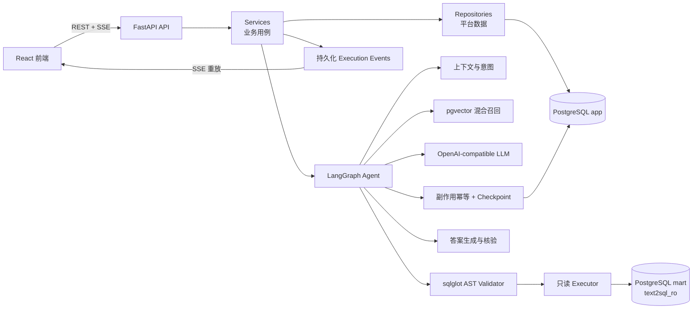
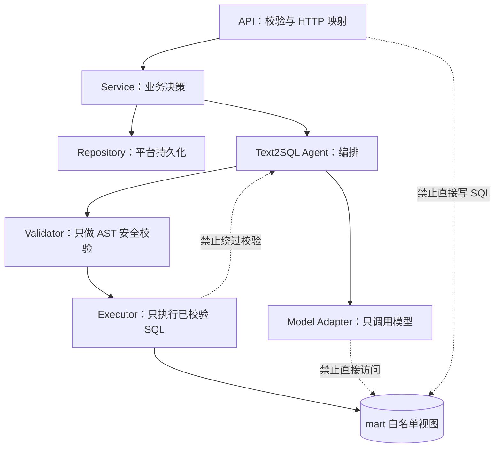
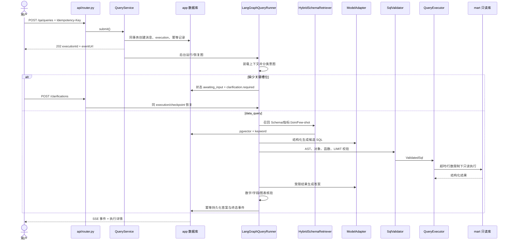
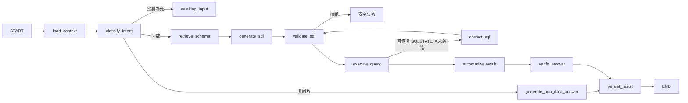
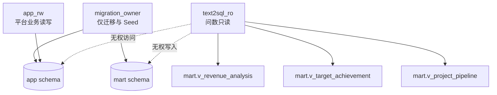
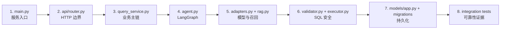

# 后端 Code Review 可视化项目地图

> 目标：让 Reviewer 快速建立“HTTP → Service → LangGraph → 安全 SQL → PostgreSQL”的完整心智模型，并能定位每个后端文件。  
> 统计口径：覆盖 `backend/` 中纳入版本控制的源码、测试、迁移、脚本、配置和文档；`.venv/`、`.runtime/`、缓存、日志和本地 Secret 不属于源码地图。

数据库表关系、字段分组、语义视图血缘和当前数据规模见 [数据库 Code Review 可视化地图](data/schema-review-map.md)。

## 1. 一图看懂后端



### 强制边界



## 2. 一次问数的真实执行链



### LangGraph 节点心智图



## 3. 完整目录树（逐文件用途）

```text
backend/
├── AGENTS.md — 后端架构、安全、数据库、Text2SQL 和测试强制规则
├── README.md — 后端启动、账号、迁移、恢复、联调和验收入口
├── pyproject.toml — Python 依赖、项目元数据、Ruff/MyPy/Pytest 配置
├── alembic.ini — Alembic 命令与迁移日志配置
├── Dockerfile — FastAPI 后端容器构建定义
├── docker-compose.yml — PostgreSQL、迁移、Seed、RAG 索引和 API 编排
├── docker/
│   └── postgres/
│       └── init-roles.sql — 创建 migration_owner、app_rw、text2sql_ro 数据库角色
├── data/
│   └── schema.sql — 初版数据库结构参考；正式演进以 Alembic 为准
├── alembic/
│   ├── env.py — 读取迁移连接、加载模型元数据并运行迁移
│   ├── script.py.mako — 新迁移文件模板
│   └── versions/
│       ├── 20260916_0001_initial.py — 创建 app/mart 初始表、视图、约束和基础权限
│       ├── 20260916_0002_message_execution_link.py — 建立消息与 execution/回答的关联
│       ├── 20260916_0003_model_call_audit.py — 增加真实模型调用审计字段
│       ├── 20260916_0004_model_protocol.py — 增加 Responses/Chat Completions 协议配置
│       ├── 20260916_0005_execution_context.py — 增加 execution 上下文快照与关联
│       ├── 20260916_0006_langgraph_vector_rag.py — 安装 pgvector、RAG 文档与 LangGraph checkpoint
│       ├── 20260916_0007_intent_clarification.py — 增加意图、缺失槽位和多轮澄清字段
│       ├── 20260916_0008_checkpoint_status_capacity.py — 扩展 checkpoint/执行状态字段容量
│       ├── 20260916_0009_idempotency_records.py — 增加请求指纹和幂等记录表
│       ├── 20260916_0010_execution_effects_leases.py — 增加副作用账本、执行租约和恢复字段
│       ├── 20260916_0011_execution_events.py — 增加可持久化、可重放 SSE 事件表
│       └── 20260916_0012_context_provenance.py — 增加上下文来源、信任与分支审计字段
├── app/
│   ├── __init__.py — Python 应用包标记
│   ├── main.py — FastAPI 工厂、生命周期、CORS、Request ID、异常处理和健康检查
│   ├── seed.py — 固定验收数据生成、幂等写入与结果校验
│   ├── recovery.py — 有界扫描并恢复 queued/租约过期 running execution 的 CLI
│   ├── event_retention.py — 有界清理终态 execution 的过期 SSE 事件并推进 floor
│   ├── api/
│   │   ├── __init__.py — API 包标记
│   │   ├── router.py — 数据源、会话、消息、问数、澄清、SSE、取消和导出路由
│   │   └── admin_router.py — 模型/应用配置、收藏、常问、反馈和日志路由
│   ├── core/
│   │   ├── __init__.py — 核心基础设施包标记
│   │   ├── config.py — 环境配置、运行模式、预算、连接和安全参数
│   │   ├── database.py — 平台读写与 Text2SQL 只读 Engine/Session 生命周期
│   │   ├── errors.py — 稳定业务异常及统一错误码基类
│   │   ├── logging.py — JSON 日志格式、Request ID 和脱敏日志初始化
│   │   └── security.py — 模型密钥 Fernet 加解密与掩码显示
│   ├── models/
│   │   ├── __init__.py — 集中导出 ORM 模型，供 Alembic 元数据发现
│   │   ├── base.py — SQLAlchemy Base、UUID 主键和创建时间 Mixin
│   │   ├── app.py — 会话、消息、执行、步骤、事件、配置、反馈、RAG 等平台模型
│   │   └── mart.py — 经营单元、行业、产品、合同、收入、回款、目标和商机模型
│   ├── schemas/
│   │   ├── __init__.py — Pydantic Schema 包导出
│   │   ├── common.py — camelCase 基类、分页、统一错误、健康和 Token 类型
│   │   ├── qa.py — 数据源、会话、消息、问数、澄清、执行、结果和版本契约
│   │   └── admin.py — 模型/应用配置、收藏、常问、反馈和日志契约
│   ├── repositories/
│   │   ├── __init__.py — Repository 包标记
│   │   └── qa.py — 会话/消息/执行查询、终态 CAS、租约领取与恢复扫描
│   ├── services/
│   │   ├── __init__.py — Service 包标记
│   │   ├── session_service.py — 会话创建、列表、更新、删除及消息读取用例
│   │   ├── query_service.py — 问数主用例：提交、运行、澄清、取消、重发、再生成、详情
│   │   ├── context_service.py — SQL 可用上下文与普通对话上下文的验证、隔离和来源记录
│   │   ├── admin_service.py — 模型配置加密 CRUD、连接测试、激活和应用配置
│   │   ├── support_service.py — 收藏、常问、反馈、问答日志和导出辅助用例
│   │   ├── idempotency.py — operation/resource/body 指纹绑定与重复请求复用
│   │   ├── execution_effects.py — 模型、SQL、持久化等外部副作用的 exactly-once 账本
│   │   ├── execution_events.py — execution 事件追加、ID 解析、游标校验、重放和终态去重
│   │   └── execution_steps.py — 节点真实耗时计算与历史模型审计回填
│   └── text2sql/
│       ├── __init__.py — Text2SQL 包公开入口
│       ├── types.py — 意图、Prompt 上下文、召回、SQL、结果和答案领域类型
│       ├── adapters.py — Fake 与 OpenAI-compatible Adapter、结构化 Prompt 和输出解析
│       ├── agent.py — Typed LangGraph State、节点、分支、预算、checkpoint 和运行器
│       ├── knowledge.py — Schema、指标、Join、Few-shot 知识文档定义
│       ├── rag.py — BGE/确定性 Embedding、索引构建和向量+关键词混合召回
│       ├── schema.py — 召回结果到模型可用 SchemaContext 和对象白名单的转换
│       ├── validator.py — sqlglot AST 只读、Schema/表/列/函数白名单和 LIMIT 校验
│       ├── executor.py — 只读连接执行、超时/结果限制、JSON 转换和 SQLSTATE 分类
│       ├── orchestrator.py — 一次受控 SQL 纠错并强制重新校验的独立编排函数
│       └── answer.py — 答案关键数字、字段、图表和追问的核验与确定性构建
├── scripts/
│   ├── build_rag_index.py — 根据文档内容哈希构建/更新 pgvector 知识索引
│   ├── evaluate_rag.py — 运行 30 条召回评测并输出 Recall@5/MRR 报告
│   ├── evaluate_prompt_security.py — 跨输入/历史/RAG/错误/结果通道评测 Prompt Injection
│   ├── smoke_http.py — 快速验证健康、基础 API 和问数 HTTP 链路
│   ├── smoke_real_model.py — 真实供应商 8 问、危险请求和模型审计冒烟报告
│   └── grant_roles.sql — 为已存在数据库补授 app_rw/text2sql_ro 最小权限
├── tests/
│   ├── evaluation/
│   │   ├── text2sql-cases.json — 30 条确定性 Text2SQL/结果验收集
│   │   ├── rag-retrieval-cases.json — RAG Top-5 期望知识对象评测集
│   │   └── prompt-injection-cases.json — 五类不可信通道攻击与控制用例
│   ├── integration/
│   │   ├── test_postgres_pipeline.py — 真实 PostgreSQL、角色权限、问数、澄清、幂等和安全集成测试
│   │   ├── test_execution_recovery.py — 租约接管、副作用复用、崩溃恢复和持久化去重测试
│   │   └── test_execution_events.py — SSE 持久化重放、并发、游标错误和保留清理测试
│   └── unit/
│       ├── test_api.py — 健康检查、统一错误、CORS 和生成 OpenAPI 测试
│       ├── test_contract.py — 运行时 FastAPI 与手写 OpenAPI 路径/参数/响应一致性测试
│       ├── test_seed.py — 固定 Seed 的规模、确定性和关键结果测试
│       ├── test_validator.py — 危险 SQL 拒绝、只读 CTE、白名单和 LIMIT 测试
│       ├── test_executor.py — SQLSTATE 可恢复/不可恢复错误分类测试
│       ├── test_orchestrator.py — 一次纠错、重新校验、超时和取消边界测试
│       ├── test_fake_adapter.py — Fake 候选 SQL 也经过相同安全路径的测试
│       ├── test_model_adapter.py — 协议、重试、结构化输出、失败关闭和 Prompt 隔离测试
│       ├── test_intent.py — 封闭意图集合、未知意图拒绝、对象边界和预算测试
│       ├── test_rag.py — Embedding 稳定性、中文分词和混合排名测试
│       ├── test_prompt_security_evaluation.py — Prompt Injection 评测全通过的回归测试
│       ├── test_evaluation_cases.py — 评测集结构与生成/校验契约测试
│       ├── test_real_model_smoke.py — 真实模型报告判定逻辑和审计证据测试
│       ├── test_idempotency.py — 规范请求指纹的稳定性与数组顺序测试
│       ├── test_answer_versions.py — 再生成版本血缘和后代查询测试
│       ├── test_execution_event_utils.py — SSE 事件 ID 与清理参数边界测试
│       ├── test_execution_steps.py — 步骤耗时、历史回填和未知耗时测试
│       └── test_recovery.py — 恢复命令必须有界的参数测试
└── docs/
    ├── README.md — 后端文档导航入口
    ├── HANDOFF.md — 当前能力、验证证据、联调方式和遗留风险
    ├── requirements.md — 后端功能和非功能需求基线
    ├── code-review-map.md — 本文件；后端可视化代码导航
    ├── api/
    │   ├── openapi.yaml — 前后端唯一 HTTP 接口契约
    │   ├── error-codes.md — 稳定错误码、HTTP 状态和语义
    │   └── contract-changelog.md — 接口字段与行为变更记录
    ├── data/
    │   ├── database-design.md — Schema、账号、约束、视图和数据生命周期设计
    │   ├── schema-review-map.md — ER 图、逐表职责、视图血缘和数据库 Review 路线
    │   ├── data-dictionary.md — 业务表、字段、类型和含义
    │   ├── metric-definitions.md — 收入、目标、回款、商机等指标口径
    │   └── seed-spec.md — 固定 Seed 规模、规则和预期查询结果
    └── text2sql/
        ├── text2sql-design.md — Text2SQL 全链路、模块和异常分支设计
        ├── sql-security-policy.md — AST、对象、函数、账号和执行安全策略
        ├── model-integration.md — 模型协议、结构化输出、密钥、重试和审计设计
        ├── real-agent-delivery-plan.md — 真实 Agent 分阶段交付与验收计划
        └── langgraph-vector-rag-plan.md — LangGraph、checkpoint、pgvector 与评测计划
```

## 4. 数据与权限图



- `app`：会话、消息、执行、配置、反馈、审计、RAG、checkpoint。
- `mart`：经营维表和事实表；模型最终只能查询授权语义视图。
- 模型本身没有数据库连接；只返回候选结构化 SQL。

## 5. Review 快速路线



| 时间 | 阅读内容 | 能回答的问题 |
|---:|---|---|
| 0～5 分钟 | `main.py`、两个 router、`schemas/` | 服务有哪些接口，错误如何统一？ |
| 5～15 分钟 | `query_service.py`、`context_service.py` | 消息、执行、澄清、重发如何保持一致？ |
| 15～30 分钟 | `agent.py`、`adapters.py`、`rag.py` | 意图、LangGraph、真实模型和 RAG 如何协作？ |
| 30～40 分钟 | `validator.py`、`executor.py`、`orchestrator.py` | 危险 SQL 为什么不能执行，纠错何时发生？ |
| 40～50 分钟 | `execution_effects.py`、`execution_events.py`、`repositories/qa.py` | 崩溃恢复、终态竞态、SSE 重放如何保证？ |
| 50～60 分钟 | 集成测试、评测脚本、OpenAPI | 设计是否有自动化证据和接口契约保护？ |

## 6. 改动影响定位

| 想改什么 | 首先查看 | 同时检查 |
|---|---|---|
| 新增/修改 API | `api/*.py`、`schemas/*.py` | `openapi.yaml`、契约测试、前端生成类型 |
| 问数行为 | `query_service.py`、`agent.py` | 幂等、副作用、租约、SSE、集成测试 |
| 意图/澄清 | `agent.py`、`adapters.py` | Schema、迁移、OpenAPI、上下文隔离 |
| 模型供应商 | `adapters.py`、`admin_service.py` | 密钥加密、协议、超时重试、审计 |
| RAG/指标知识 | `knowledge.py`、`rag.py` | 数据字典、指标口径、召回评测 |
| SQL 能力 | `schema.py`、`validator.py`、`executor.py` | 只读账号、白名单、30 条评测、安全用例 |
| 执行恢复 | `repositories/qa.py`、`execution_effects.py` | 迁移、CAS、租约、取消优先级 |
| SSE | `execution_events.py`、`api/router.py` | 事件迁移、Last-Event-ID、保留清理、前端 |
| 数据库字段 | `models/` + 新 Alembic 迁移 | Seed、Schema、OpenAPI、回滚风险 |

## 7. Review 红线

- LLM 不得持有数据库连接，也不得直接执行 SQL。
- 所有候选 SQL 必须经过 `SqlValidator`；纠错结果同样重新完整校验。
- Text2SQL 只能使用 `text2sql_ro`，且不能访问 `app` 或系统 Schema。
- `demo`/`prod` 没有真实模型时必须失败关闭，不能静默回退 Fake。
- API Key 只能来自运行时 Secret 或加密存储，不能进入响应、普通日志和仓库。
- 用户输入、历史、RAG、数据库错误和查询结果都是不可信 Prompt 数据。
- execution 终态必须使用条件更新；外部副作用必须先检查副作用账本。
- SSE 是可重放通知，执行详情才是最终事实来源。
