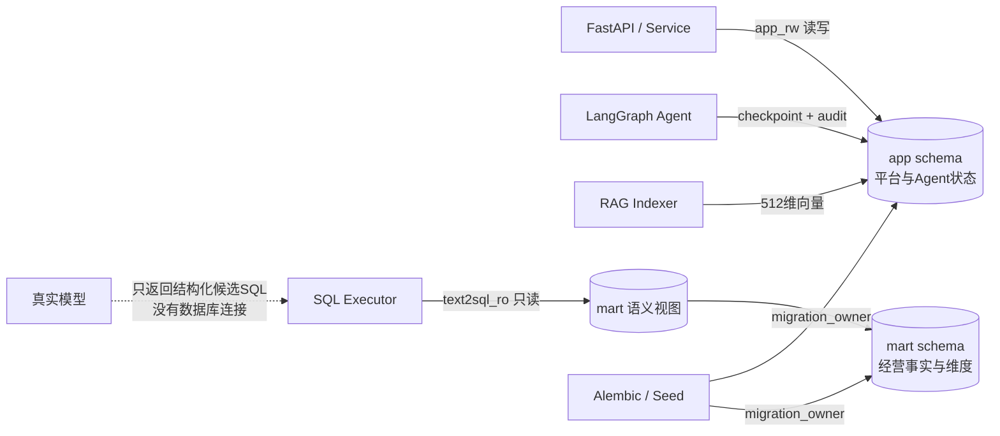
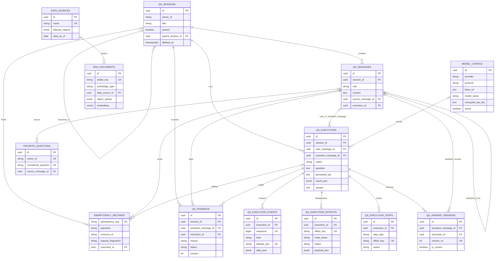
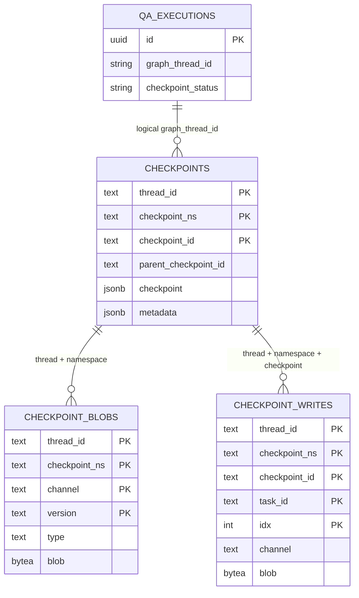
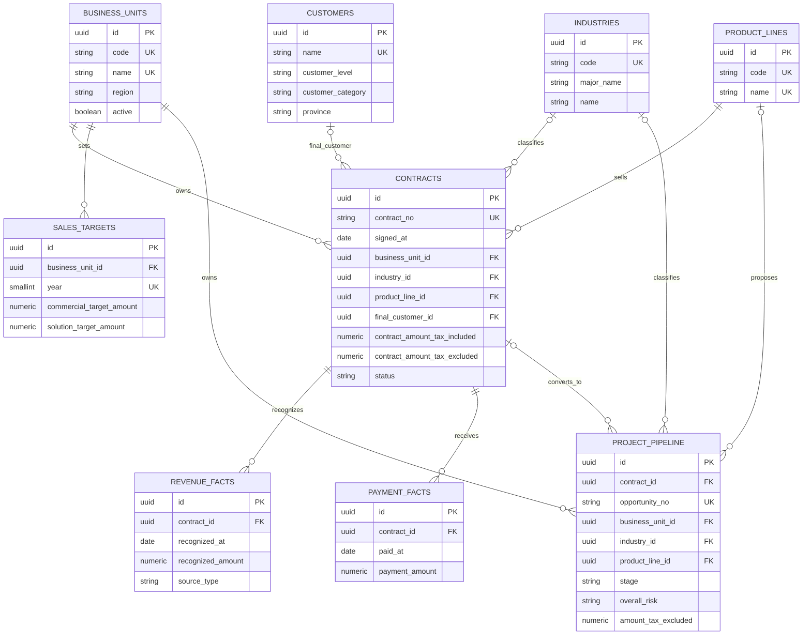
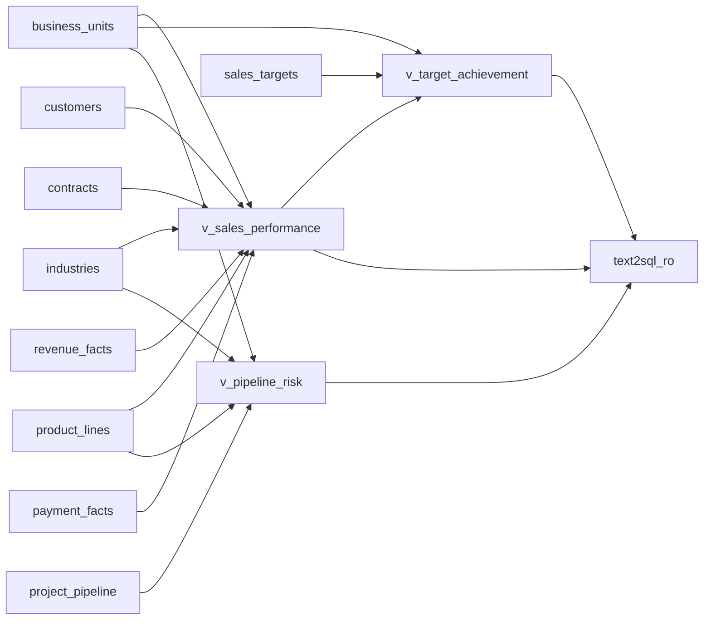
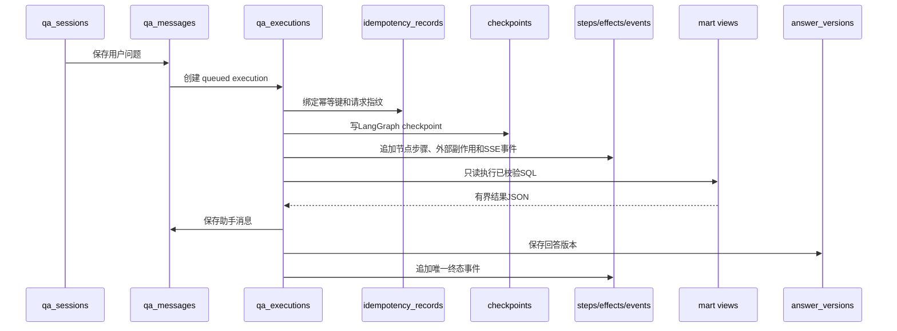

# 数据库 Code Review 可视化地图

> 用途：代码 Review 和故障定位。结构以 2026-09-18 当前运行中的 PostgreSQL 16 数据库、SQLAlchemy 模型和 Alembic head 为准。  
> 范围：`app` 平台业务、LangGraph checkpoint、`mart` 经营数据和 Text2SQL 语义视图。

## 1. 一图看懂数据库边界

核心隔离原则：

- `app` 保存平台状态、模型配置、执行审计、RAG 和 checkpoint，不向 Text2SQL 查询账号开放。
- `mart` 保存经营事实；模型生成的 SQL 最终只能通过 `text2sql_ro` 查询3个授权视图。
- `LLM Adapter` 不直接连接数据库；`QueryExecutor` 只接受已通过 AST 校验的 SQL。

## 2. 当前对象清单

| Schema | 对象 | 数量 | 职责 |
|---|---|---:|---|
| `app` | 平台业务表 | 15 | 会话、消息、执行、事件、配置、反馈、幂等、RAG |
| `app` | LangGraph checkpoint 表 | 4 | 图状态、通道 Blob、节点写入和迁移版本 |
| `mart` | 经营基础表 | 9 | 组织、客户、合同、收入、回款、目标和商机 |
| `mart` | 只读语义视图 | 3 | Text2SQL 唯一授权查询入口 |
| 合计 | 表和视图 | 31 | 不包含 PostgreSQL 系统表和 `alembic_version` |

## 3. `app` 平台业务关系图

### `app` 表职责

| 表 | 主键 | 关键约束/外键 | 用途 |
|---|---|---|---|
| `application_config` | `id boolean` | 单例配置、`version` 乐观并发 | 开场白、推荐问题、追问、常问、STT/TTS等应用开关 |
| `data_sources` | UUID | `name` 唯一 | 数据截止日和 Text2SQL 对象白名单 |
| `model_configs` | UUID | `name` 唯一；部分唯一索引保证最多一个 active | 模型协议、地址、模型名和加密密钥 |
| `qa_sessions` | UUID | 自引用 `parent_session_id`；软删除 | 会话及编辑重发产生的分支 |
| `qa_messages` | UUID | 会话、来源消息和 execution 外键 | 用户、助手和澄清消息正文 |
| `qa_executions` | UUID | `idempotency_key` 唯一；多条消息/模型外键 | 一次 Agent 执行的最终事实记录 |
| `idempotency_records` | `idempotency_key` | operation/resource/body fingerprint 绑定 | 重复提交复用，冲突请求拒绝 |
| `qa_execution_steps` | UUID | `(execution_id,effect_key)` 唯一 | 前端可见的审计步骤状态 |
| `qa_execution_effects` | UUID | `(execution_id,effect_key)` 唯一 | 模型调用、SQL和持久化副作用 exactly-once 账本 |
| `qa_execution_events` | UUID | `(execution_id,sequence)`、`(execution_id,dedupe_key)` 唯一 | 可持久化、可重放的 SSE 事件 |
| `qa_answer_versions` | UUID | `(assistant_message_id,version_no)` 唯一 | 再生成回答的版本链 |
| `qa_feedback` | UUID | session/message/execution 外键；`version` 并发字段 | 回答反馈和人工处理闭环 |
| `favorite_questions` | UUID | `(owner_id,normalized_question)` 唯一 | 快捷提问中的收藏问题 |
| `rag_documents` | UUID | `stable_key` 唯一；向量固定512维 | Schema、字段、指标、Join和Few-shot知识 |
| `seed_versions` | `version` | 每个 Seed 版本只写一次 | 固定验收数据幂等标记 |

## 4. `qa_executions` 字段分组

`qa_executions` 是 Review 时最重要的表。它不是只存“SQL结果”，而是一次 Agent 运行的聚合根。

| 字段组 | 字段 | Review 关注点 |
|---|---|---|
| 请求身份 | `id`、`request_id`、`idempotency_key`、`session_id` | 请求追踪、重复提交和会话隔离 |
| 消息关系 | `user_message_id`、`assistant_message_id`、`regenerated_from_execution_id` | 原问题、回答和再生成血缘 |
| 意图澄清 | `question`、`intent`、`normalized_question`、`missing_slots`、`intent_confidence`、`intent_reason_code`、`clarification_round`、`clarification_json`、`clarification_history` | 非问数不应进入 SQL；澄清最多两轮 |
| 上下文/RAG | `data_source_ids`、`context_message_ids`、`context_provenance`、`selected_objects`、`rag_document_ids`、`rag_degraded` | 同会话、可信历史、召回对象与最终SQL对象交集 |
| SQL执行 | `generated_sql`、`executed_sql`、`validation_summary`、`result_json`、`row_count` | 候选与实际SQL分离；结果受行数和体积限制 |
| 回答输出 | `answer`、`chart_json`、`follow_up_questions` | 数字/字段核验和白名单图表 |
| 模型审计 | `model_config_id`、`model_name`、`token_usage`、`model_call_audit` | 不保存密钥和思维链 |
| LangGraph | `graph_version`、`graph_thread_id`、`graph_node_trace`、`checkpoint_status` | 图版本、节点轨迹和恢复状态 |
| 多实例恢复 | `lease_owner`、`lease_expires_at`、`heartbeat_at`、`run_attempt` | 租约领取、失效接管和取消优先 |
| SSE保留 | `event_sequence_floor` | 低于 floor 的旧游标稳定返回410 |
| 终态 | `status`、`duration_ms`、`error_code`、`error_message`、`completed_at` | 终态CAS、防止取消被迟到完成覆盖 |

## 5. LangGraph checkpoint 结构

| 表 | 用途 | 注意点 |
|---|---|---|
| `checkpoint_migrations` | LangGraph checkpoint Schema版本 | 由 Checkpointer 管理，不承载业务版本 |
| `checkpoints` | 每个图执行点的状态和元数据 | `thread_id` 使用 execution UUID，但当前是逻辑关联、没有数据库外键 |
| `checkpoint_blobs` | 大型/二进制通道值按版本拆分保存 | 数量会显著高于 execution 数量 |
| `checkpoint_writes` | 节点任务的通道写入日志 | 是当前数据量最大的表，需关注保留和清理策略 |

## 6. `mart` 经营数据关系图

### `mart` 表职责和粒度

| 表 | 数据粒度 | 关键约束 | 用途 |
|---|---|---|---|
| `business_units` | 一个经营单元 | code、name唯一 | 经营组织维度 |
| `industries` | 一个二级行业 | code唯一；major_name+name唯一 | 行业层级维度 |
| `product_lines` | 一条产品线 | code、name唯一 | 产品维度 |
| `customers` | 一个最终客户 | name唯一 | 客户级别、类别和省份维度 |
| `contracts` | 一份合同 | contract_no唯一；金额/数量非负；状态枚举 | 合同主事实及维度外键 |
| `revenue_facts` | 合同的一次收入确认 | 金额非负 | 月度收入和未确认金额 |
| `payment_facts` | 合同的一次回款 | 金额非负 | 回款、未回款和应收分析 |
| `sales_targets` | 经营单元×自然年 | business_unit_id+year唯一 | 商业目标和商解目标 |
| `project_pipeline` | 一个商机/项目 | opportunity_no唯一 | 阶段、四类风险、预计落地和排产 |

## 7. Text2SQL语义视图血缘

| 视图 | 面向问题 | 主要输出 |
|---|---|---|
| `mart.v_sales_performance` | 收入趋势、合同额、回款、应收、产品/行业/客户分析 | 合同和月份、组织维度、含/不含税金额、收入、回款、未确认、未回款 |
| `mart.v_target_achievement` | 各经营单元年度商业/商解目标及完成率 | 年份、经营单元、目标额、收入额、两类完成率 |
| `mart.v_pipeline_risk` | 商机阶段、签约/交付/竞争/综合风险 | 项目、组织、行业、产品、风险、预计日期、金额、排产状态 |

Text2SQL Review 需要确认：`data_sources.allowed_objects`、RAG召回对象、模型 `selectedObjects` 和SQL AST实际对象取交集后，只能落在以上视图。

## 8. 一次问数的数据生命周期

## 9. 当前数据规模快照

> 抽样时间：2026-09-18。行数用于容量判断，不是固定验收契约。

| 分类 | 表 | 当前行数 |
|---|---|---:|
| 平台 | `qa_sessions` | 129 |
| 平台 | `qa_messages` | 255 |
| 平台 | `qa_executions` | 149 |
| 审计 | `qa_execution_steps` | 560 |
| 审计 | `qa_execution_effects` | 135 |
| 审计 | `qa_execution_events` | 806 |
| 版本 | `qa_answer_versions` | 95 |
| 幂等 | `idempotency_records` | 209 |
| RAG | `rag_documents` | 18 |
| Checkpoint | `checkpoints` | 4,972 |
| Checkpoint | `checkpoint_blobs` | 14,461 |
| Checkpoint | `checkpoint_writes` | 37,865 |
| 维度 | `business_units` / `industries` / `product_lines` / `customers` | 21 / 8 / 3 / 60 |
| 合同 | `contracts` | 600 |
| 事实 | `revenue_facts` / `payment_facts` | 1,800 / 1,200 |
| 目标 | `sales_targets` | 42 |
| 商机 | `project_pipeline` | 180 |

容量观察：checkpoint 写入量远高于业务 execution 数量，这是图状态逐节点持久化的正常结果；正式长期运行前应为 checkpoint 增加与 execution 终态、审计保留期一致的清理策略。

## 10. 迁移演进地图

数据库结构变更只能新增 Alembic 迁移，不能只修改 ORM 或手工改当前数据库。

## 11. Code Review 推荐顺序

1. 先看 `mart` ER 图和3个视图，确认业务指标的数据来源。
2. 看 `qa_sessions → qa_messages → qa_executions`，理解问数主记录关系。
3. 看 `steps/effects/events` 的差异：展示步骤、幂等副作用、SSE通知不能混为一张表。
4. 看 checkpoint 的逻辑关联和数据增长，确认恢复与保留策略。
5. 看 `idempotency_records`、execution租约和终态字段，确认并发与重试安全。
6. 最后核对角色授权，确保 `text2sql_ro` 只能读取3个 `mart` 视图。

## 12. Review检查项

- [ ] ORM模型与 Alembic head 一致，变更可从空库重放。
- [ ] 金额使用 `numeric(18,2)`，业务时间按日期或带时区时间保存。
- [ ] `qa_messages`、execution、版本和反馈血缘可追溯。
- [ ] 幂等键同时绑定 operation、resource和请求指纹。
- [ ] execution终态使用条件更新，取消优先于迟到完成。
- [ ] 模型/SQL/持久化副作用通过 `qa_execution_effects` 去重。
- [ ] SSE sequence单调，dedupe_key唯一，过期游标受floor保护。
- [ ] checkpoint没有被误当成业务事实或前端接口数据。
- [ ] RAG向量不包含密钥、连接串、用户隐私和完整经营事实行。
- [ ] SQL只访问授权视图，不能访问 `app`、基础表或系统Schema。
- [ ] Seed固定、幂等，核心评测结果重复执行一致。
