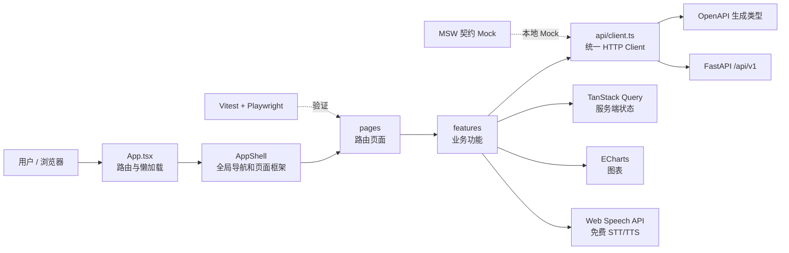
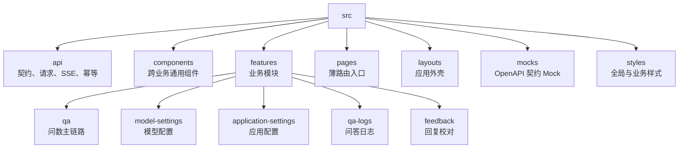
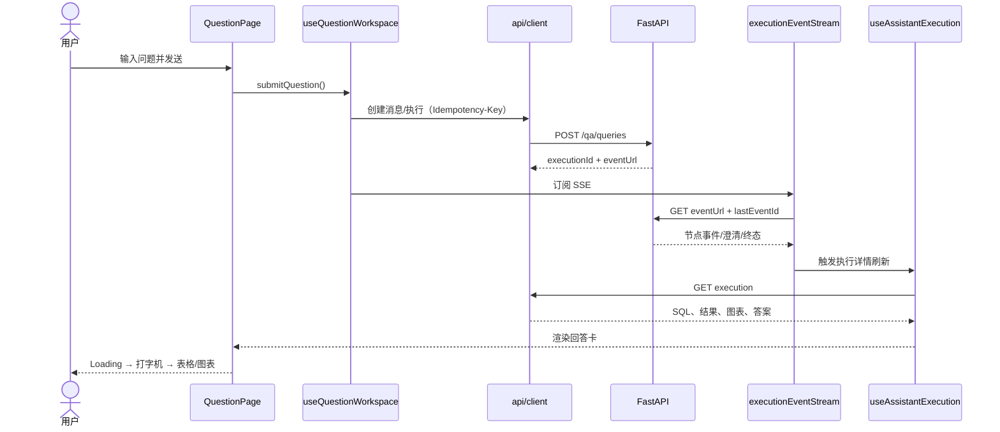
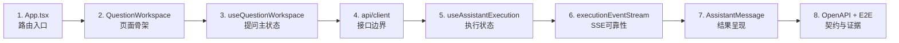

# 前端 Code Review 可视化项目地图

> 目标：让 Reviewer 在 10 分钟内看懂前端边界，在 30 分钟内走通核心问数链路，并能快速定位每个文件。  
> 统计口径：覆盖 `frontend/` 中纳入版本控制的源码、测试、配置和文档；`node_modules/`、`dist/`、Playwright 报告、缓存和运行日志不属于源码地图。

## 1. 一图看懂前端



### 目录职责图



## 2. 核心问数调用链



异常分支只需记住四条：

- `awaiting_input`：`ClarificationPrompt` 收集补充信息，继续同一 execution。
- SSE 断线：`executionEventStream` 携带游标重连，达到上限后轮询降级。
- 图表不可用：`ResultChart` 降级保留 `ResultTable`。
- 刷新恢复：`executionRecovery` 找到未结束执行，重新挂接状态而不重复提交。

## 3. 完整目录树（逐文件用途）

```text
frontend/
├── AGENTS.md — 前端开发、架构、安全、测试和目录约束
├── README.md — 前端任务入口、本地启动、联调和门禁命令
├── Dockerfile — 构建 SPA 并交由 Nginx 托管的容器镜像
├── nginx.conf — SPA 路由回退、静态资源及后端/SSE 反向代理配置
├── index.html — Vite HTML 入口和 React 挂载节点
├── package.json — 依赖、开发脚本、API 生成与质量门禁
├── pnpm-lock.yaml — pnpm 精确依赖锁定文件（生成文件）
├── pnpm-workspace.yaml — pnpm 工作区声明
├── eslint.config.js — ESLint 与 TypeScript/React 静态检查规则
├── playwright.config.ts — Playwright 浏览器、服务启动和报告配置
├── vite.config.ts — Vite 开发、构建、代理及插件配置
├── vitest.config.ts — Vitest 单测环境、覆盖范围和别名配置
├── tsconfig.json — TypeScript 根配置与子配置引用
├── tsconfig.app.json — 浏览器端源码 TypeScript 严格配置
├── tsconfig.node.json — Vite/测试等 Node 配置文件的类型设置
├── public/
│   └── mockServiceWorker.js — MSW 浏览器 Service Worker（生成文件，不手改）
├── docs/
│   ├── README.md — 前端文档导航入口
│   ├── HANDOFF.md — 当前实现状态、联调规则、完成项和遗留项
│   ├── requirements.md — 前端功能与非功能需求基线
│   ├── design.md — 前端架构、状态管理、路由和组件设计
│   ├── ui-design-system.md — 颜色、字号、间距、组件和可访问性基线
│   ├── api-issues.md — 前端发现的接口契约问题与处理状态
│   └── code-review-map.md — 本文件；前端可视化代码导航
├── e2e/
│   └── qa.spec.ts — 问数、SSE、澄清、日志、快捷问题、导出等端到端回归
└── src/
    ├── main.tsx — 启动 Mock（如启用）并挂载 React 应用
    ├── App.tsx — QueryClient、路由、页面懒加载和根级错误边界
    ├── vite-env.d.ts — Vite 环境变量类型声明
    ├── api/
    │   ├── client.ts — 唯一 HTTP API Client；封装所有 REST 请求和错误映射
    │   ├── client.test.ts — API Client 请求参数、响应和异常行为测试
    │   ├── types.ts — 从 OpenAPI 类型提取的前端便捷别名
    │   ├── queryKeys.ts — TanStack Query 缓存键集中定义
    │   ├── errorMessages.ts — 后端错误码到用户提示的安全映射
    │   ├── errorMessages.test.ts — 错误码映射和未知错误降级测试
    │   ├── fetchEventSource.ts — 可取消、可恢复、可解析命名事件的 SSE 传输层
    │   ├── fetchEventSource.test.ts — SSE 解析、事件 ID、取消和异常测试
    │   ├── idempotency.ts — 根据操作/资源/正文生成稳定幂等键
    │   ├── idempotency.test.ts — 幂等键稳定性、差异性和长度测试
    │   └── generated/
    │       └── schema.ts — 由后端 OpenAPI 生成的接口类型（生成文件，不手改）
    ├── components/
    │   ├── CopyButton.tsx — 通用复制图标按钮及成功/失败反馈
    │   ├── EmptyState.tsx — 通用空数据占位
    │   ├── ErrorState.tsx — 通用错误提示和重试入口
    │   ├── RouteLoading.tsx — 懒加载路由的统一 Loading
    ├── layouts/
    │   └── AppShell.tsx — 顶栏、主导航、内容滚动容器和响应式外壳
    ├── pages/
    │   ├── QuestionPage.tsx — `/qa` 问数页面入口，只组合问数工作区
    │   ├── QaLogsPage.tsx — `/qa/logs` 问答日志页面入口
    │   ├── ApplicationSettingsPage.tsx — `/settings/application` 应用配置入口
    │   └── FeedbackPage.tsx — `/feedback` 回复校对入口
    ├── features/
    │   ├── application-settings/
    │   │   ├── index.ts — 应用配置模块公开导出
    │   │   ├── ApplicationSettings.tsx — 应用配置页面编排与保存区
    │   │   ├── ApplicationConfigForm.tsx — 应用能力总表单与校验
    │   │   ├── WelcomeSettingsCard.tsx — 对话开场白能力卡片及欢迎语/推荐问题编辑弹窗
    │   │   ├── RecommendedQuestionsField.tsx — 推荐问题增删、排序和数量约束
    │   │   ├── QaCapabilitySettingsCard.tsx — 追问、常问、STT/TTS 等问数能力开关
    │   │   └── useApplicationSettings.ts — 应用配置查询、保存及缓存失效 Hook
    │   ├── model-settings/
    │   │   ├── index.ts — 模型配置模块公开导出
    │   │   ├── ModelSettingsModal.tsx — 应用配置内的模型管理弹窗编排
    │   │   ├── ModelConfigCards.tsx — 场景模型选择与安全连接列表（不显示密钥）
    │   │   ├── ModelConfigDialog.tsx — 模型新增/编辑；密钥仅首次输入或主动更换时出现
    │   │   ├── ModelConfigCards.tsx — 模型卡片列表、启用、编辑和删除入口
    │   │   ├── ModelConfigCards.test.tsx — 卡片布局、操作和密钥掩码测试
    │   │   ├── ModelConfigDialog.tsx — 新增/编辑模型弹窗与连接测试
    │   │   ├── modelForm.ts — 模型表单初值、协议和请求体转换纯函数
    │   │   ├── modelForm.test.ts — 模型表单转换和边界测试
    │   │   └── useModelSettings.ts — 模型 CRUD、测试、启用和缓存管理 Hook
    │   ├── feedback/
    │   │   ├── index.ts — 回复校对模块公开导出
    │   │   ├── FeedbackReview.tsx — 筛选、表格、详情和处理弹窗总编排
    │   │   ├── FeedbackFilterForm.tsx — 问题、用户、状态筛选表单
    │   │   ├── FeedbackTable.tsx — 反馈列表、分页和处理入口
    │   │   ├── FeedbackTable.test.tsx — 表格展示、分页和交互测试
    │   │   ├── feedbackColumns.tsx — 表格列定义
    │   │   ├── FeedbackDetailDrawer.tsx — 问题、回答、SQL 与执行信息详情抽屉
    │   │   ├── FeedbackProcessDialog.tsx — 状态与备注处理弹窗
    │   │   ├── feedbackPresentation.ts — 状态文案、颜色和展示格式映射
    │   │   ├── feedbackTypes.ts — 模块内部 UI 类型
    │   │   └── useFeedbackReview.ts — 列表查询、筛选、处理和缓存更新 Hook
    │   ├── qa-logs/
    │   │   ├── QaLogReview.tsx — 日志筛选、固定分页和详情总编排
    │   │   ├── QaLogFilter.tsx — 关键词、用户、状态和时间筛选
    │   │   ├── QaLogTable.tsx — 独立滚动区的日志表格
    │   │   ├── QaLogTable.test.tsx — 表格高度、分页和展示测试
    │   │   ├── QaLogDetailDrawer.tsx — SQL、RAG、模型、节点和请求审计详情
    │   │   └── qaLogPresentation.ts — 日志状态、意图和数值的展示格式
    │   └── qa/
    │       ├── index.ts — 问数模块公开导出
    │       ├── README.md — 问数模块边界与文件导航
    │       ├── workspace/
    │       │   ├── QuestionWorkspace.tsx — 会话栏、消息区、输入区和快捷问题总布局
    │       │   ├── QuestionWorkspaceHeader.tsx — 当前会话标题和顶部操作
    │       │   ├── useQuestionWorkspace.ts — 问数主控制器：会话、提交、分支、收藏和取消
    │       │   ├── useConversationScroll.ts — 新消息跟随、用户滚动保护和回到底部
    │       │   ├── executionRecovery.ts — 从历史消息识别并恢复未结束执行
    │       │   └── executionRecovery.test.ts — 刷新恢复、终态和重复执行识别测试
    │       ├── sessions/
    │       │   ├── SessionSidebar.tsx — 会话列表、新建、分页与折叠
    │       │   ├── SessionSidebar.test.tsx — 会话切换、菜单和折叠测试
    │       │   └── SessionListItem.tsx — 单条会话及置顶、重命名、删除菜单
    │       ├── conversation/
    │       │   ├── MessageList.tsx — 消息与 execution 锚点去重后的列表渲染
    │       │   ├── MessageList.test.tsx — 消息顺序、回答锚点和去重测试
    │       │   ├── UserMessage.tsx — 用户问题、复制、收藏、编辑重发和重新生成
    │       │   ├── PlainAssistantMessage.tsx — 无 execution 的普通助手消息
    │       │   ├── WelcomePanel.tsx — 新会话开场白与推荐问题
    │       │   └── messageExecutionAnchors.ts — 计算消息与回答执行的稳定挂载位置
    │       ├── composer/
    │       │   ├── QuestionComposer.tsx — 文本输入、键盘发送、语音和现代化发送按钮
    │       │   ├── QuestionComposer.test.tsx — 发送、禁用、键盘、语音状态测试
    │       │   └── DataSourcePicker.tsx — 数据源分组、选择、全选和不可用说明
    │       ├── quick-questions/
    │       │   ├── QuickQuestions.tsx — 常问/收藏弹层和问题回填
    │       │   ├── QuickQuestions.test.tsx — Tab、关闭、回填和空状态测试
    │       │   └── FavoriteQuestionButton.tsx — 用户问题收藏/取消收藏图标按钮
    │       ├── speech/
    │       │   ├── browserSpeech.ts — Web Speech 能力检测、错误翻译和中文音色选择
    │       │   ├── browserSpeech.test.ts — 浏览器语音兼容和错误映射测试
    │       │   ├── useBrowserSpeechRecognition.ts — STT 生命周期、停止和识别文本 Hook
    │       │   ├── SpeechPlaybackButton.tsx — 回答 TTS 播放/停止图标按钮
    │       │   └── SpeechPlaybackButton.test.tsx — TTS 支持、播放、停止和卸载清理测试
    │       └── answer/
    │           ├── AssistantMessage.tsx — 单个 execution 回答卡总编排
    │           ├── AssistantMessageHeader.tsx — 助手身份、执行状态和模型摘要
    │           ├── ExecutionContext.tsx — 回答子组件共享 execution 上下文
    │           ├── useAssistantExecution.ts — 执行详情轮询、澄清、反馈、导出和版本操作
    │           ├── useExecutionEventRefresh.ts — SSE 订阅、游标恢复和轮询降级 Hook
    │           ├── executionEventStream.ts — execution SSE 状态机与事件去重
    │           ├── executionEventStream.test.ts — 重连、410 回退、终态和澄清事件测试
    │           ├── ExecutionSteps.tsx — LangGraph 可审计步骤的折叠展示
    │           ├── ClarificationPrompt.tsx — 缺失槽位补充、轮次和取消等待 UI
    │           ├── ClarificationPrompt.test.tsx — 澄清提交、防双击和边界测试
    │           ├── AnswerContent.tsx — 回答正文 Loading、打字机及完成态内容组合
    │           ├── AnswerContent.test.tsx — Loading、历史恢复和动画选择测试
    │           ├── TypewriterText.tsx — 新回答短时打字机效果与减弱动画适配
    │           ├── TypewriterText.test.tsx — 动画推进、跳过和清理测试
    │           ├── AnswerHighlights.tsx — 结果集首行派生的可信摘要要点展示
    │           ├── buildAnswerHighlights.ts — 在不推导新事实前提下生成摘要要点
    │           ├── answerHighlights.test.ts — 摘要字段、空值和数量限制测试
    │           ├── AnswerEvidence.tsx — “为什么是这个答案”的数据来源与规模说明
    │           ├── SqlViewer.tsx — 只读 SQL、校验状态和复制
    │           ├── ResultTable.tsx — 中文表头、格式化、排序和行高亮结果表
    │           ├── ResultTable.test.tsx — 表头、格式、排序、空值和联动测试
    │           ├── resultColumnLabel.ts — 数据库字段到中文列名的规则与降级
    │           ├── resultColumnLabel.test.ts — 已知字段、未知字段和命名转换测试
    │           ├── resultColumnVisibility.ts — 结果列隐藏/展示判定
    │           ├── resultColumnVisibility.test.ts — 技术列和业务列可见性测试
    │           ├── formatResultValue.ts — 金额、百分比、日期、整数和空值格式化
    │           ├── formatResultValue.test.ts — 各数据类型格式化测试
    │           ├── ResultChart.tsx — ECharts 图表、表格联动、类型切换和 PNG 导出
    │           ├── ResultChart.test.ts — 图表配置、降级和交互测试
    │           ├── chartOption.ts — 后端图表建议到安全 ECharts option 的转换
    │           ├── chartViewOptions.ts — 柱/线/饼图可用性与切换规则
    │           ├── chartViewOptions.test.ts — 类型切换、维度和饼图数量限制测试
    │           ├── chartExport.ts — ECharts PNG 快照和安全文件名下载
    │           ├── FollowUpQuestions.tsx — 推荐追问展示并回填输入框
    │           ├── followUpSuggestions.ts — 无后端追问时的保守探索建议
    │           ├── followUpSuggestions.test.ts — 追问优先级和降级建议测试
    │           ├── AnswerActions.tsx — 复制、朗读、反馈、重新生成、版本和 CSV 操作
    │           ├── AnswerActions.test.tsx — 图标可访问名称、禁用和回调测试
    │           ├── AnswerVersionsDrawer.tsx — 回答版本链、当前版本、SQL 和模型信息
    │           └── FeedbackModal.tsx — 对当前回答提交反馈的弹窗
    ├── mocks/
    │   ├── browser.ts — 创建浏览器端 MSW Worker
    │   ├── enableMocking.ts — 根据环境变量决定是否启动 Mock
    │   ├── handlers.ts — 严格按 OpenAPI 模拟 REST、SSE 和状态变化
    │   └── data.ts — 可重复的契约 Mock 基础数据与内存状态
    ├── styles/
    │   ├── global.css — Reset、设计 Token、全局布局和通用状态
    │   ├── qa.css — 问数页面、消息、输入、表格和图表样式
    │   └── settings.css — 应用/模型配置及反馈/日志页面样式
    └── test/
        └── setup.ts — Vitest DOM、浏览器 API 和测试清理初始化
```

## 4. Review 快速路线



推荐阅读时间：

| 时间 | 阅读内容 | 能回答的问题 |
|---:|---|---|
| 0～5 分钟 | `App.tsx`、`AppShell.tsx`、`pages/` | 有哪些页面，路由和布局如何组织？ |
| 5～15 分钟 | `QuestionWorkspace.tsx`、`useQuestionWorkspace.ts`、`api/client.ts` | 用户提交问题后发生了什么？ |
| 15～25 分钟 | `useAssistantExecution.ts`、`executionEventStream.ts`、`AssistantMessage.tsx` | SSE、澄清、恢复和回答如何闭环？ |
| 25～30 分钟 | `e2e/qa.spec.ts`、关键 `*.test.*` | 关键行为由什么自动化证据保护？ |

## 5. 改动影响定位

| 想改什么 | 首先查看 | 同时检查 |
|---|---|---|
| API 字段/接口 | `api/generated/schema.ts`、`api/client.ts` | 后端 OpenAPI、Mock handlers、相关 Hook |
| 问数流程 | `useQuestionWorkspace.ts` | 幂等键、SSE、恢复、E2E |
| 执行状态/SSE | `executionEventStream.ts`、`useExecutionEventRefresh.ts` | 轮询降级、410、StrictMode 清理 |
| 回答样式 | `AssistantMessage.tsx`、`AnswerContent.tsx` | `qa.css`、Loading、历史恢复、可访问性 |
| 表格/图表 | `ResultTable.tsx`、`ResultChart.tsx` | 格式化、中文列名、降级、导出 |
| 会话功能 | `SessionSidebar.tsx`、`useQuestionWorkspace.ts` | 消息锚点、缓存键、删除后跳转 |
| 模型/应用配置 | 对应 feature 的页面 + Hook | 密钥不回显、表单并发、OpenAPI |
| 日志/反馈 | `qa-logs/` 或 `feedback/` | 固定分页、脱敏详情、筛选缓存 |

## 6. Review 红线

- 页面和组件不得直接拼 URL 或绕过 `api/client.ts`。
- 不手改 `api/generated/schema.ts`；先改后端 OpenAPI，再重新生成。
- 不把 API Key、完整 SQL 结果或敏感日志写入浏览器持久存储。
- SSE 事件是通知，执行详情接口才是最终事实来源。
- 模型文本、数据库值和错误内容只按不可信文本渲染。
- 图表失败必须保留表格；语音失败必须保留文字问答。
