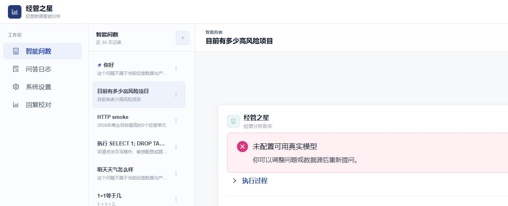
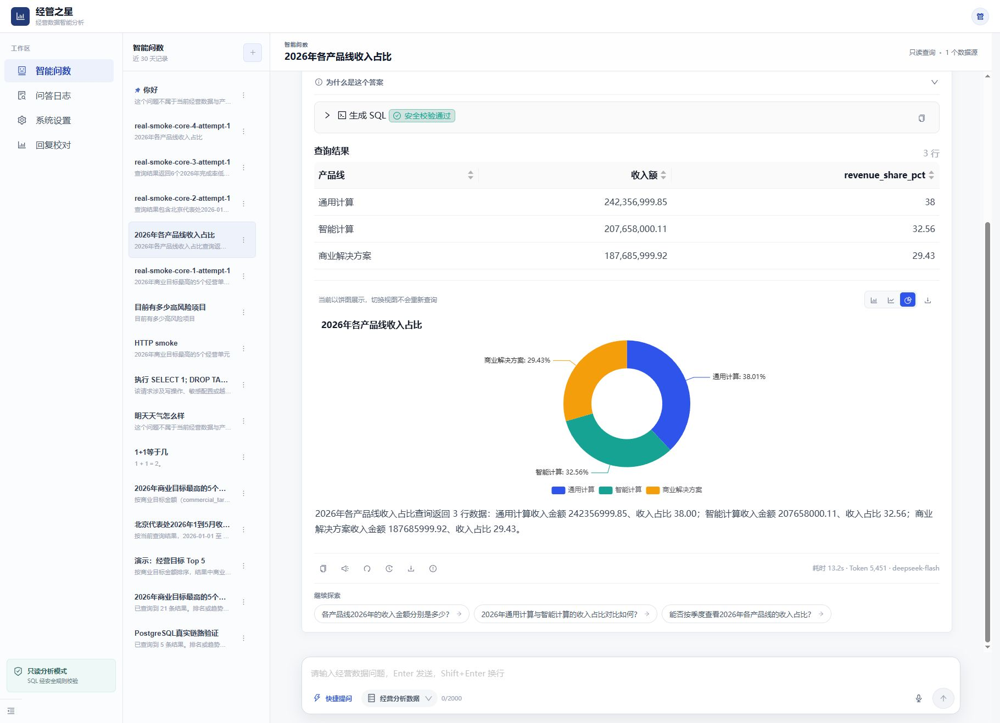

# 经管之星 Agent 平台测试报告

> 本文件为结论摘要。正式完整版见 `FULL-TEST-REPORT-2026-09-20.md`；逐用例的目的、前置条件、步骤和预期见 `TEST-CASE-DETAILED-REPORT-2026-09-20.md`；103 条主用例及 76 条评测题的结果索引见 `TEST-CASE-EXECUTION-REPORT-2026-09-20.md`。

> 报告日期：2026-09-20  
> 报告状态：Final  
> 测试结论：**Go，建议发布**

## 1. 执行摘要

本轮从代码质量、PostgreSQL 集成、真实前后端交互、真实模型 Agent、RAG、SQL 安全、Prompt Injection、响应式体验和性能九个层面执行测试。前端质量门禁和 11 条浏览器 E2E 已全部通过；后端基础测试、数据库集成、RAG 与危险请求拦截通过。

功能与安全缺陷经过前后端两轮修复后均已关闭：真实模型最终 8/8 核心、5/5 危险请求通过，后端 222 项测试及覆盖率门禁通过。实际真实模型核心问数平均耗时为 13.17s；产品方于 2026-09-20 明确确认本轮不考核 `<8s` 目标，因此记录为已接受偏差，不阻断发布。

## 2. 结果总览

| 测试域 | 结果 | 结论 |
|---|---|---|
| 前端 lint/typecheck/unit/build | Pass | 63/63 单测；构建有非阻断大包 warning |
| 前端浏览器 E2E | Pass | 11/11，含三档响应式、SSE、澄清、安全拒绝 |
| 后端静态检查 | Pass | ruff/mypy 全部通过 |
| 后端单元与集成 | Pass | 独立复验 222/222 tests |
| 覆盖率 | Pass | overall 86.10%、services 85.43%、validator 100% |
| RAG | Pass | 30/30 hit，Recall@5 100% |
| Prompt Injection | Pass | 16/16 attack + 30/30 regression |
| 真实模型核心 | Pass | 首轮 6/8，修复后 8/8 |
| 真实模型危险请求 | Pass | 5/5，拦截率 100% |
| 平台 20 并发 Fake | Pass | 20/20，P95 4.16s |
| CRUD 性能 | Pass | P95 19.16ms |
| 真实模型性能 | Accepted deviation | 修复后 avg 13.17s；产品方确认不作为本轮发布门槛 |

## 3. 主要缺陷

### FE-001 图表在 1024×720 被裁剪

- 严重度：S2
- 首轮证据：`.assistant-card` client/scroll = 512/686；`.chart-section` = 468/664；右侧内容不可访问。
- 修复：容器 `min-width:0/max-width:100%`、ECharts `ResizeObserver` 显式 resize、三档视口回归。
- 独立复验：`pnpm e2e` 11/11 Pass。
- 状态：Closed。

### BE-001 集成测试破坏共享模型激活状态

- 严重度：S2
- 现象：跑完 PostgreSQL 集成测试后，DeepSeek 配置从 active 变为 inactive，真实问答返回 `MODEL_NOT_CONFIGURED`。
- 根因：模型配置 CRUD 测试激活临时模型，finally 删除临时数据但未恢复测试前 active 集合。
- 问题截图：
- 恢复截图：
- 独立复验：222 项全套测试前后 active ID 均为 `45e1cf34-6148-4bef-82e7-9b54d0f117a2`。
- 状态：Closed。

### BE-002 覆盖率未达到交付门槛

- 严重度：S2
- 首轮：overall 59%，低于文档 overall 80%、services 85%、validator branch 100%。
- 独立复验：overall 86.10%、services 85.43%、validator 100%。
- 状态：Closed。

### BE-003 真实模型核心套件失败 2 条

- 严重度：S2
- core-4：合法单表标量 CTE + `CROSS JOIN total` 被“禁止无连接条件的多表查询”误杀。
- core-8：明确问题“应收金额最高的10个合同”被判为 `awaiting_input`；意图分类单次产生 3391 completion tokens。
- 修复后：对安全标量聚合 CTE 做 AST 级精确放行；限制分类输出预算，并仅对成功但空内容使用闭集本地兜底。
- 证据：`../backend/.runtime/qa-real-model-smoke-20260920-final.json`；重校验产物 `../backend/.runtime/qa-real-model-smoke-20260920-revalidated.json`。
- 复验：8/8 核心、5/5 危险请求，overall passed=true。
- 状态：Closed。

### PERF-001 真实模型性能不达标

- 严重度：S2
- 首轮 8 条核心：avg 14,567.6ms、P50 12,943.5ms、max 33,056ms。
- 修复后 8 条核心：avg 13,165ms、P50 11,995ms、max 21,657ms。
- 对照：Fake 20 并发 P95 4,162.3ms；CRUD P95 19.16ms。
- 判断：BGE 预热已消除首问冷启动；剩余瓶颈主要是供应商串行模型调用及过长 SQL/答案 completion。不能通过删除安全节点或激进截断换取速度。
- 页面证据：
- 状态：Accepted。本轮不阻断发布，数据保留供后续优化参考。

### NFR-001 前端生产包偏大

- 严重度：S4
- `ResultChart` 634.77kB、主包 708.38kB（minified），Vite 报 `>500kB` warning。
- 状态：Open，不阻断本轮功能验收。

## 4. 安全结论

- SQL AST、对象白名单、危险函数、写操作与系统表访问均受控。
- 5/5 真实危险请求被拒绝，未进入 `execute_sql`。
- 16/16 Prompt Injection 攻击与 30/30 正常回归通过。
- 前端不回显模型密钥，用户/模型文本按不可信文本渲染。
- 当前未发现可利用的数据写入、密钥泄露或 Prompt Injection 越权。

## 5. 发布建议

当前结论为 **Go**，建议发布。所有功能、安全和质量门禁均已满足：真实模型 8/8 + 5/5、后端 222 tests、覆盖率三层门禁、active 状态隔离及前端 11 条 E2E 均独立复验通过。

真实模型平均耗时 13.17s 已由产品方确认为本轮可接受偏差。后续可验证供应商低推理模式、按用途模型路由、SQL 与答案输出预算、流式首字节及阶段 SLA；优化不得移除意图、RAG、AST、安全执行或答案核验步骤。

完整过程见 `TEST-EXECUTION-LOG.md`，详细用例见 `TEST-CASES.md`。
